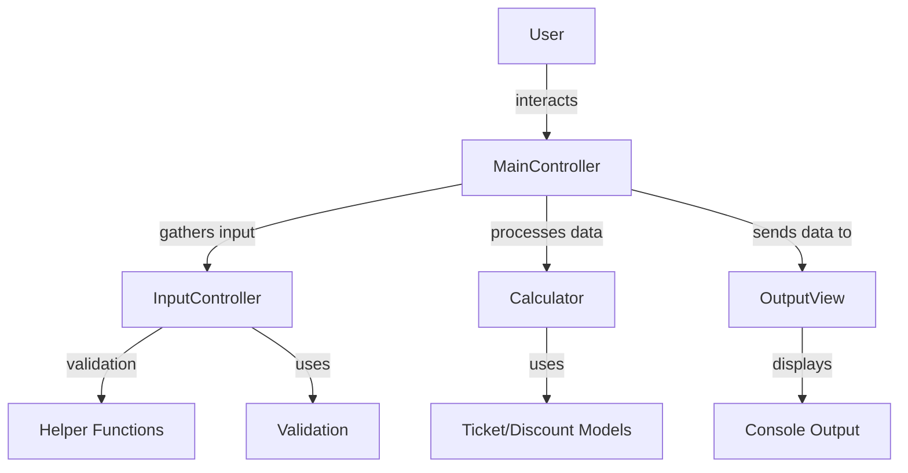
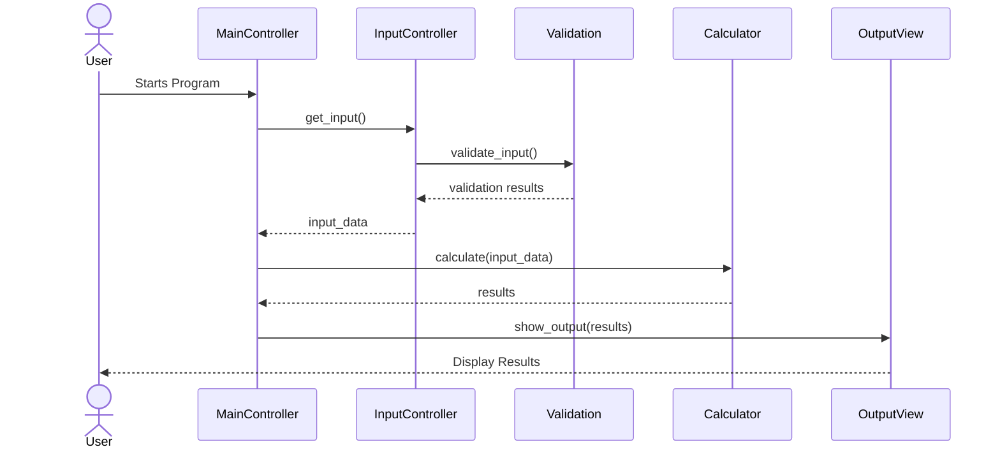
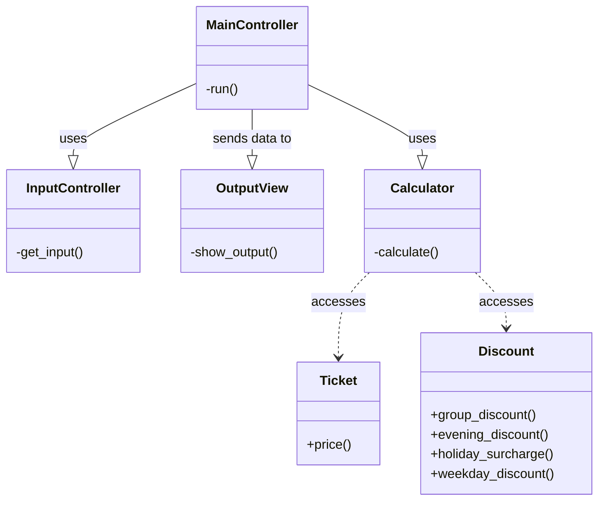

## System Diagrams for CLI Ticket Sales Calculator

### 1. High-Level Architecture Diagram

This diagram provides an overview of the MVC architecture of the CLI program.

**Components**:
- Models: `Ticket`, `Calculator`, `Discount`
- Views: `OutputView`
- Controllers: `InputController`, `MainController`
- Helpers: `Validation`, `Helper` functions

### 2. Sequence Diagram

This diagram illustrates the flow of operations in the CLI program, particularly focusing on how a user's input is processed and how output is generated.

**Flow**:
1. User starts the program, interacting with `MainController`.
2. `MainController` calls `InputController` to gather user input.
3. User input is validated and processed.
4. `MainController` uses `Calculator` (Model) to process the data.
5. Results are sent to `OutputView` (View) to display the final output to the user.

### 3. Class Diagram

This diagram shows the relationships between different classes in the CLI program.

**Components**:
- `Ticket`
- `Calculator`
- `Discount`
- `InputController`
- `MainController`
- `OutputView`

### Notes

- The High-Level Architecture Diagram provides an overview of the system.
- The Sequence Diagram details the interaction flow in the program.
- The Class Diagram illustrates the relationships and dependencies between classes.
