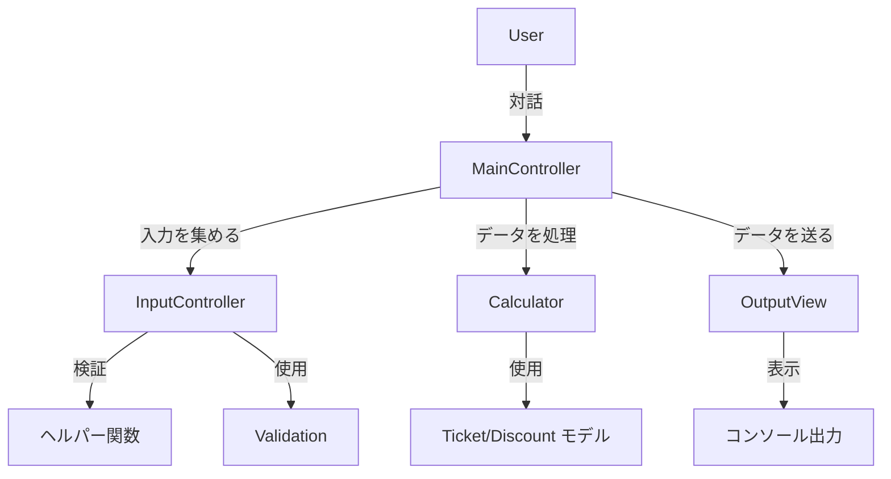
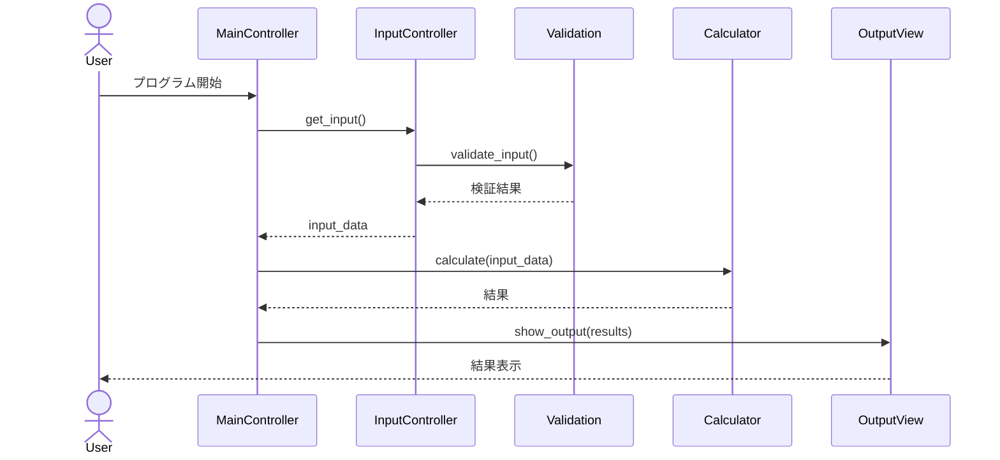
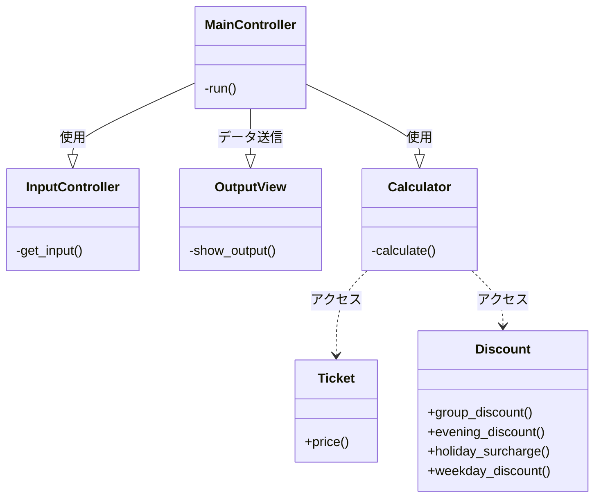

## CLIチケット販売計算システム図

### 1. 高レベルアーキテクチャ図

この図は、CLIプログラムのMVCアーキテクチャの概要を提供します。

**コンポーネント**:
- モデル: `Ticket`, `Calculator`, `Discount`
- ビュー: `OutputView`
- コントローラー: `InputController`, `MainController`
- ヘルパー: `Validation`, `Helper` 関数

### 2. シーケンス図

この図は、CLIプログラムの操作の流れを示し、特にユーザーの入力がどのように処理され、出力が生成されるかに焦点を当てています。

**フロー**:
1. ユーザーがプログラムを開始し、`MainController`と対話します。
2. `MainController`はユーザーの入力を集めるために`InputController`を呼び出します。
3. ユーザー入力が検証され、処理されます。
4. `MainController`はデータを処理するために`Calculator`（モデル）を使用します。
5. 結果は`OutputView`（ビュー）に送られ、最終出力をユーザーに表示します。

### 3. クラス図

この図は、CLIプログラム内の異なるクラス間の関係を示しています。

**コンポーネント**:
- `Ticket`
- `Calculator`
- `Discount`
- `InputController`
- `MainController`
- `OutputView`

### 備考

- 高レベルアーキテクチャ図は、システムの概要を提供します。
- シーケンス図は、プログラム内の相互作用の流れを詳細に説明します。
- クラス図は、クラス間の関係と依存関係を示します。
